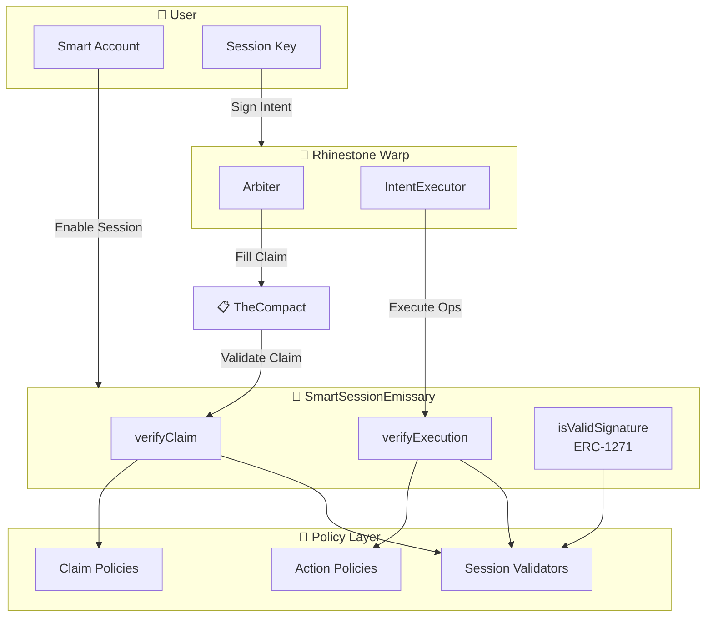
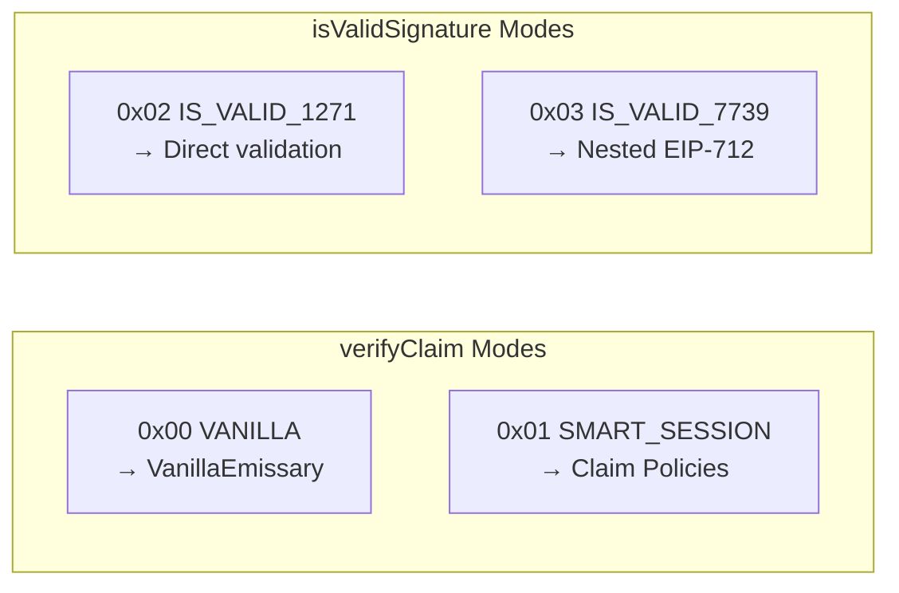
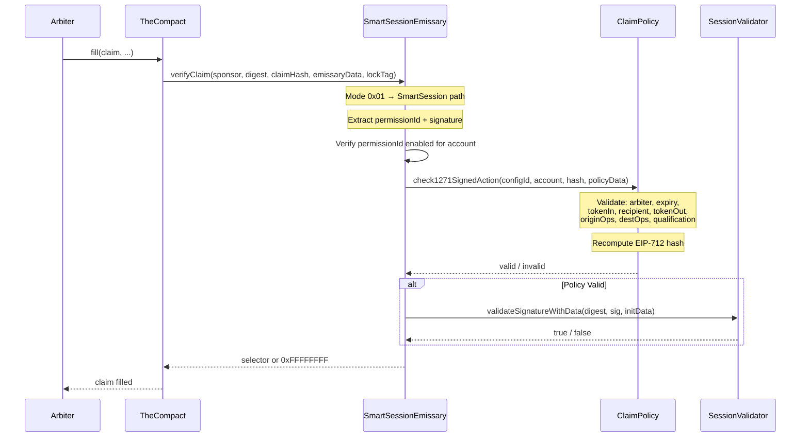
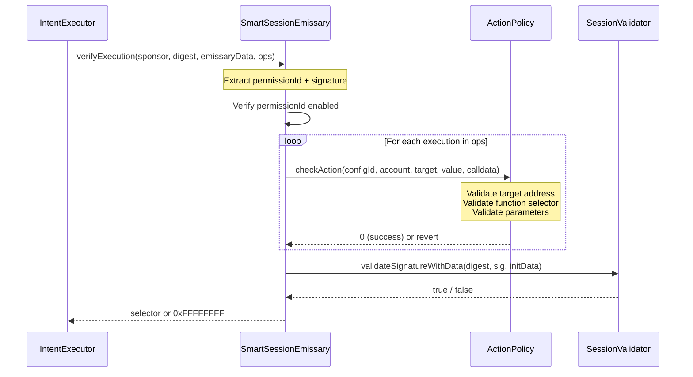
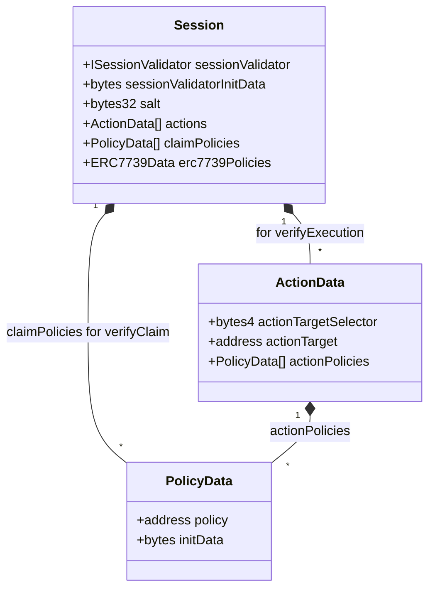
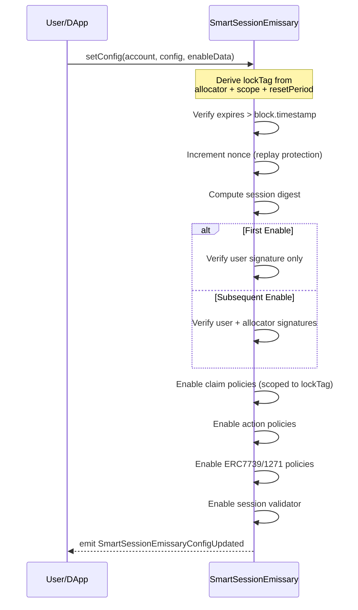

# SmartSessionEmissary

SmartSessionEmissary extends [SmartSessions](https://github.com/erc7579/smartsessions) to work with [The Compact](https://github.com/Uniswap/the-compact) protocol for intent-based cross-chain operations. It combines SmartSessions' policy-based session key management with Compact's claim verification system.

## Overview

SmartSessionEmissary is built on two foundational systems:

1. **SmartSessions (v1)**: ERC-7579 session key management with granular policy control
2. **VanillaEmissary**: Basic emissary functionality for The Compact (ECDSA, WebAuthn, custom validators)

This contract adds **claim policies** and **execution validation** to enable session keys to authorize Compact claims within configurable constraints.

## Features

- **All SmartSessions v1 features**:

  - Granular session key control
  - Action-specific policies
  - ERC-1271 signature validation with ERC-7739 nested EIP-712
  - Enable flow for permission requests
  - Native ERC-7579 batched execution support

- **All VanillaEmissary features** (inherited):

  - Built-in ECDSA validation
  - Built-in WebAuthn/Passkey validation
  - Custom stateless validator support

- **New in SmartSessionEmissary**:
  - Claim policies for Compact protocol validation
  - Execution validation for pre-claim and destination operations
  - LockTag-scoped policy isolation
  - Multi-mode signature routing

---

## Architecture

### High-Level Flow



### What SmartSessionEmissary Adds

SmartSessionEmissary combines `VanillaEmissary` (inherited) with SmartSession policy enforcement:

| Component                        | Source            | Purpose                                                  |
| -------------------------------- | ----------------- | -------------------------------------------------------- |
| `verifyClaim()`                  | **New**           | Validates Compact claims with claim policies             |
| `verifyExecution()`              | **New**           | Validates pre-claim/dest executions with action policies |
| `isValidSignatureWithSender()`   | **New**           | ERC-1271 with mode-based routing                         |
| `setConfig()` / `removeConfig()` | SmartSessionMixin | Session lifecycle management                             |
| ECDSA/Passkey validation         | VanillaEmissary   | Built-in signature validation                            |
| Custom validators                | VanillaEmissary   | External stateless validators                            |

---

## Signature Validation Modes

The first byte of signature data determines the validation path:



### verifyClaim Flow (SmartSession Mode)

When TheCompact calls `verifyClaim` with mode `0x01`:



### verifyExecution Flow

When IntentExecutor calls `verifyExecution` for pre-claim or destination operations:



---

## Session Management

### Session Structure

A session defines what a session key can do:



### Policy Scoping

| Policy Type      | Scope                     | Used By                                                        |
| ---------------- | ------------------------- | -------------------------------------------------------------- |
| Claim Policies   | Per lockTag               | `verifyClaim` - different allocators have isolated policy sets |
| Action Policies  | Per permissionId (global) | `verifyExecution` - pre-claim and destination ops              |
| ERC1271 Policies | Per permissionId (global) | `isValidSignature` calls                                       |

### Enable Session Flow



---

## Claim Policies

Claim policies validate Rhinestone Warp claims against configurable rules. The base policy supports these fields:

| Field              | Description                                              |
| ------------------ | -------------------------------------------------------- |
| Arbiter            | Whitelist of allowed arbiters                            |
| Expiry             | Min/max claim expiration bounds                          |
| TokenIn            | Allowed input tokens (+ lockTag for Compact)             |
| Recipient          | Allowed recipient addresses per chain                    |
| FillExpiry         | Min/max fill deadline bounds per chain                   |
| TokenOut           | Whitelist of output tokens per chain                     |
| OriginOps          | Whether origin operations are required                   |
| DestOps            | Whether destination operations are required              |
| Qualification      | Parameter validation rules                               |
| RecipientIsSponsor | Flag to enforce recipient == sponsor (no storage lookup) |

### Policy Configuration Modes

Each field has a 2-bit mode controlling validation behavior:

```
Mode 00 = SKIP            → Don't validate this field
Mode 01 = CHECK_STORAGE   → Validate against stored config (exact chainId)
Mode 10 = CHECK_CATCHALL  → Validate with chainId=0 fallback (wildcard)
Mode 11 = CHECK_SUBPOLICY → Delegate to external policy contract
```

All fields support all four modes, except `RECIPIENT_IS_SPONSOR` which is a simple flag - when mode != SKIP, it enforces `recipient == sponsor` with no storage lookup required.

---

## Security Considerations

### Replay Protection

- **Nonce per (account, lockTag)**: Each session enable/disable increments a nonce specific to the account and lockTag combination
- **Expires timestamp**: All enable/disable operations have an expiration time
- **Chain ID validation**: Multichain sessions explicitly include chainIds to prevent cross-chain replay

### Signature Requirements

| Operation       | First Time                  | Subsequent                  |
| --------------- | --------------------------- | --------------------------- |
| Enable Session  | User signature only         | User + Allocator signatures |
| Disable Session | User + Allocator signatures | User + Allocator signatures |

The rationale: initial setup creates the config before allocator has committed resources. Updates require allocator approval to protect allocated resources.

### Policy Isolation

- **LockTag scoping**: Claim policies are isolated per lockTag, preventing cross-allocator policy conflicts
- **PermissionId binding**: Each session has a unique permissionId derived from `(sessionValidator, initData, salt)`
- **No unsafe fallbacks**: `UnsafeFallbackNotAllowed` error prevents dangerous wildcard action policies

### Digest Caching

Validated digests are cached per `(account, permissionId)` to:

- Prevent double-validation attacks during multi-step flows
- Allow efficient re-verification within the same transaction

### Trust Model

```
┌─────────────────────────────────────────────────────────────┐
│                      Trust Boundaries                       │
├─────────────────────────────────────────────────────────────┤
│  User (Smart Account)                                       │
│  └── Trusts: Session validators they configure              │
│  └── Trusts: Policies they enable                           │
│  └── Controls: Which sessions exist                         │
├─────────────────────────────────────────────────────────────┤
│  Allocator                                                  │
│  └── Controls: Whether sessions can be modified             │
│  └── Protects: Resources allocated to the account           │
├─────────────────────────────────────────────────────────────┤
│  Session Key Holder                                         │
│  └── Can only: Sign within policy constraints               │
│  └── Cannot: Modify session configuration                   │
│  └── Cannot: Exceed policy limits                           │
├─────────────────────────────────────────────────────────────┤
│  IntentExecutor                                             │
│  └── Only caller: That can invoke verifyExecution           │
│  └── Enforced by: onlyIntentExecutor modifier               │
└─────────────────────────────────────────────────────────────┘
```

---

## Usage

### Signature Format for SmartSession Mode

```
┌────────────────────────────────────────────────────────────┐
│  [0]        Mode byte (0x01 = EMISSARY_SMART_SESSION)      │
│  [1:33]     PermissionId (bytes32)                         │
│  [33:65]    Policy data offset (uint256)                   │
│  [65:N]     Session validator signature                    │
│  [N:...]    Policy-specific data (for claim policies)      │
└────────────────────────────────────────────────────────────┘
```

### VanillaEmissary Mode (Inherited)

For simple ECDSA/Passkey validation without policies:

```
┌────────────────────────────────────────────────────────────┐
│  [0]        Mode byte (0x00 = EMISSARY_VANILLA)            │
│  [1:21]     Validator address (ECDSA=0x1, Passkey=0x1001)  │
│  [21]       Config ID (uint8)                              │
│  [22:...]   Signature data                                 │
└────────────────────────────────────────────────────────────┘
```

---

## Related Projects

- [SmartSessions v1](https://github.com/erc7579/smartsessions) - Base session key management
- [The Compact](https://github.com/Uniswap/the-compact) - Cross-chain intent protocol
- [compact-utils](https://github.com/rhinestonewtf/compact-utils) - Compact protocol utilities

## License

AGPL-3.0
